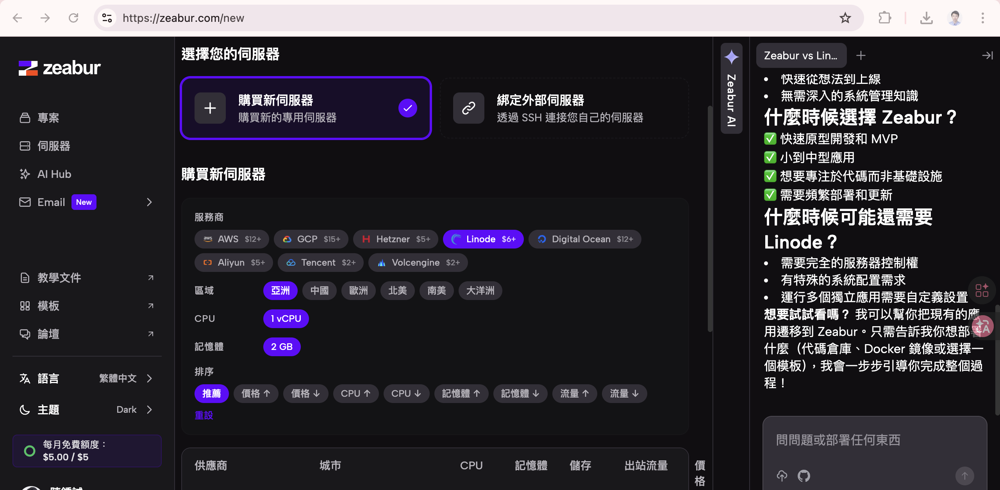

https://zeabur.com/

## 什麼時候選擇 Zeabur？
✅ 快速原型開發和 MVP
✅ 小到中型應用
✅ 想要專注於代碼而非基礎設施
✅ 需要頻繁部署和更新

## 什麼時候可能還需要 Linode？
需要完全的服務器控制權
有特殊的系統配置需求
運行多個獨立應用需要自定義設置
想要試試看嗎？ 我可以幫你把現有的應用遷移到 Zeabur。只需告訴我你想部署什麼（代碼倉庫、Docker 鏡像或選擇一個模板），我會一步步引導你完成整個過程！